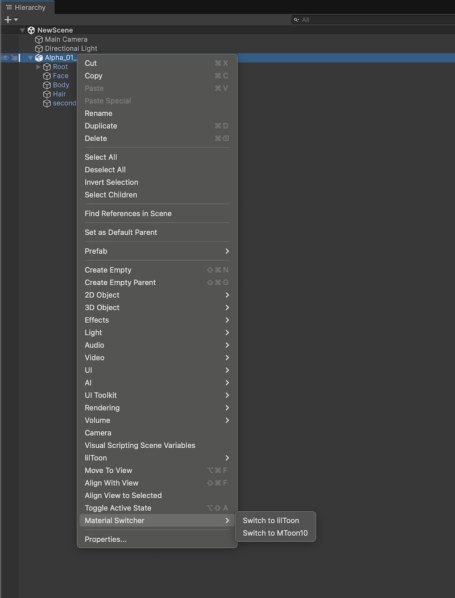
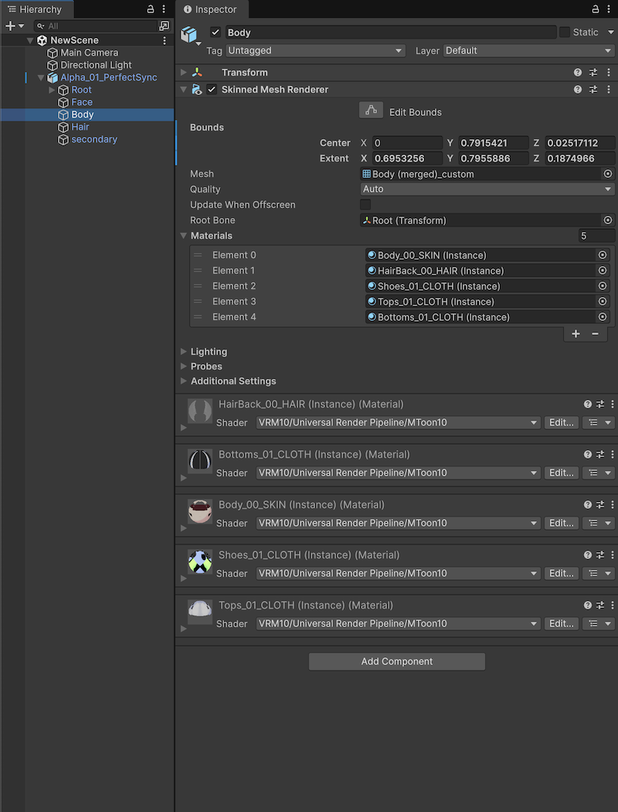
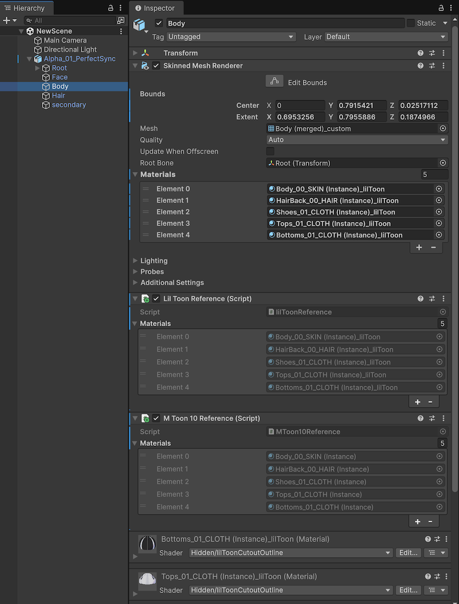

# Unity Material Switcher

## 概要
[Unity Material Switcher](
https://github.com/sotanmochi/UnityMaterialSwitcher)は、GameObjectに適用されているマテリアルを異なるシェーダーのマテリアルに切り替えるための拡張可能なライブラリです。

### 利用可能なマテリアル
- [lilToon](https://github.com/lilxyzw/lilToon)
- [MToon10](https://github.com/vrm-c/UniVRM)

### 利用可能なコンバーター
- [LilToonToMToonConverter](./src/UnityMaterialSwitcher/Assets/UnityMaterialSwitcher/Runtime/Converters/LilToonToMToonConverter.cs): lilToonマテリアルをMToon10に変換する
- [MToonToLilToonConverter](./src/UnityMaterialSwitcher/Assets/UnityMaterialSwitcher/Runtime/Converters/MToonToLilToonConverter.cs): MToon10マテリアルをlilToonに変換する

### 動作の仕組み
GameObjectとその子オブジェクトに適用されているすべてのマテリアルを、指定したシェーダータイプのマテリアルに一括で切り替えます。
1. **マテリアル参照の確認**: `MaterialReference`コンポーネントから、切り替え先のシェーダータイプのマテリアルを取得します。
2. **新規マテリアルの作成**: マテリアル参照情報が存在しない場合、切り替え先のシェーダーで新規マテリアルを作成します。
3. **自動プロパティ変換**: 新規作成時のみ、コンバーターを使用して元のマテリアルプロパティを解析し、変換先のマテリアルに可能な限り同等の値を自動設定します。
4. **参照の保存**: `MaterialReference`コンポーネントに各シェーダータイプのマテリアルの参照情報を保存し、次回の切り替え時に再利用できるようにします。

## 使い方
### マテリアルの切り替え
  - Hierarchyウィンドウで対象のGameObjectを選択する
  - 右クリックメニューから `Material Switcher > Switch to lilToon` または `Switch to MToon10` を選択する

#### メニュー


#### 切り替え前（MToon10）


#### 切り替え後（lilToon）


## インストール方法
UnityエディターのPackage Managerからインストールできます。

1. Package Managerウィンドウを開く
2. `+` ボタンをクリックして「Add package from git URL」を選択する
3. 次のURLを入力: `https://github.com/sotanmochi/UnityMaterialSwitcher.git?path=src/UnityMaterialSwitcher/Assets/UnityMaterialSwitcher#0.2.0`

Packages/manifest.jsonを直接編集してインストールすることも可能です。
```json
// Packages/manifest.json
{
  "dependencies": {
    ...
    "jp.sotanmochi.unitymaterialswitcher": "https://github.com/sotanmochi/UnityMaterialSwitcher.git?path=src/UnityMaterialSwitcher/Assets/UnityMaterialSwitcher#0.2.0",
    ...
  }
}
```

## 参考情報
- [UnityMaterialSwitcher-Samples](https://github.com/sotanmochi/UnityMaterialSwitcher-Samples)（サンプルプロジェクト）

## ライセンス情報
- [MITライセンス](https://github.com/sotanmochi/UnityMaterialSwitcher/blob/main/LICENSE)
